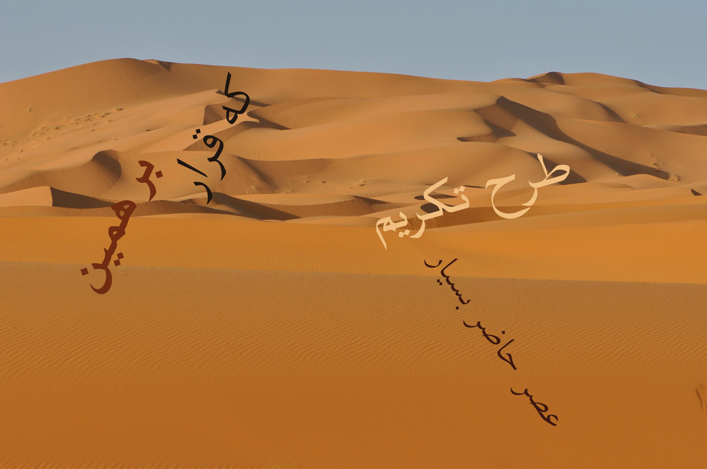

# Persian-scene-text-recognition

We provide a persian synthetic scene text images which can be used for text detection, text recognition, and end-to-end text recognition model.
We provide two kinds of datasets:

**a) cropped word images (for text recognition)**


**b) scene text images (for text detection and end-to-end text recognition)**




## Demo for getting background images, creating dataset, reading images and annotation files, displaying images
The "demo.ipynb" is provided to get background images and using them to create dataset. At the end of this file, images and annotation files are read and use to display images and add a bounding box for each word.


## Download our dataset
We have two datasets:

**a) cropped word images (for text recognition)**

The scene_word_dataset.zip can be accessed [this google drive link](https://drive.google.com/file/d/1oXB7667IZ0Iy4zceXDyUNr5SQwmemOSM/view?usp=sharing).
Unzip scene_text_dataset.zip for images and annotation files.

You can get the file this way:
```
pip install --upgrade gdown
gdown --id 1oXB7667IZ0Iy4zceXDyUNr5SQwmemOSM
```

You can also get the dataset from [our website](http://zekavat.itrc.ac.ir/)


The scene_word_dataset.zip includes images and annotation files. An annotation file (gt.txt) is also provided. Each line of this file includes the name of one of the cropped word images and the text in that image in double quotation. The name and the text are separated with comma.

**b) scene text images (for text detection and end-to-end text recognition)**

The scene_text_dataset.zip can be accessed [this google drive link](https://drive.google.com/file/d/1V-r4a1XZVf-3QHcD_4eBBQy6IXQTgvfw/view?usp=sharing).
Unzip scene_text_dataset.zip for images and annotation files.

You can get the file this way:
```
pip install --upgrade gdown
gdown --id 1V-r4a1XZVf-3QHcD_4eBBQy6IXQTgvfw
```
You can also get the dataset from [our website](http://zekavat.itrc.ac.ir/)

## Create your own scene text images dataset
To create your own dataset you can run synthText.py and if the shape of text in images is incorrect you can run synthText_forLinux.py instead.
You can also provide different background images, text source, fonts, and colors.
If you want to use same background images that we used and provided from [this repository](https://github.com/ankush-me/SynthText), you can try:
```
sudo apt-get install aria2 -q
aria2c https://academictorrents.com/download/2dba9518166cbd141534cbf381aa3e99a087e83c.torrent --allow-overwrite=true --select-file=1 --seed-time=0 -q
tar -zxvf bg_img.tar.gz
```

## Create your own cropped word images dataset
To create your own dataset you can run cropped_word_synthText.py
You can also provide different background images, text source, fonts, and colors.
If you want to use same background images that we used, see [here](https://github.com/zekavat-ITRC/Persian-scene-text-recognition-Dataset#create-your-own-scene-text-images-dataset).
